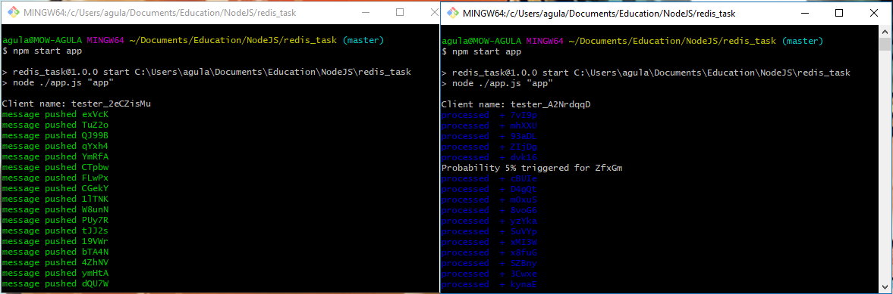
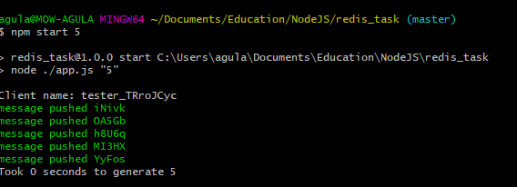

# Redis_task

## The task
This should be an application that works with redis.
It should be able to generate and process messages.
If run with 'getErrors' flag - it should output all corrupted messages to the screen, deleting them from the DB, and terminate.

Conditions:
- In parallel as many applications as needed can be run.
- All the information exchange is done only through redis.
- Only one app at a time can generate messages(generator), all other started apps can only process(processors).
- Any app can become a generator.
- If the current generator is terminated, then one of the processors should replace the generator.
- The processor, has 5% probability to determine that a message is corrupted.
- If the message was marked as corrupted it should be placed in redis for later research.
- Messages are generated every 500 ms.
- Each messages must be processed, and only once.
- Message is generated as a random text response from a function.

## Usage
First app is a generator. If only one app is up - also a generator.
All the rest are processors.

To start a normal app use:
`npm start app`

For the sake of testing you can set a number of messages to generate
`npm start n`
where n is the number

